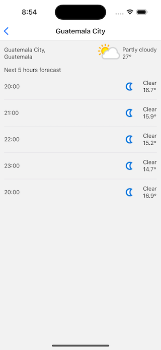

 
# Getting Started

Prepare a working react native environment

create a .env file with correct API values
```
API_URL=http://api.weatherapi.com/v1
API_KEY=EXAMPLE
```

download dependencies
```bash
npm install
```
 
install ios dependencies
```bash
npm run install:pods
```
 

# Run the project

on ios
```bash
npm run ios
```

on android
```bash
npm run android
```

# Run unit test
 
```bash
npm test
``` 


# TODO
- add e2e
- create a backend to avoid API keys bundle into the app
- migrate to expo


# Screenshots

Home Screen  


Forecast Screen  
